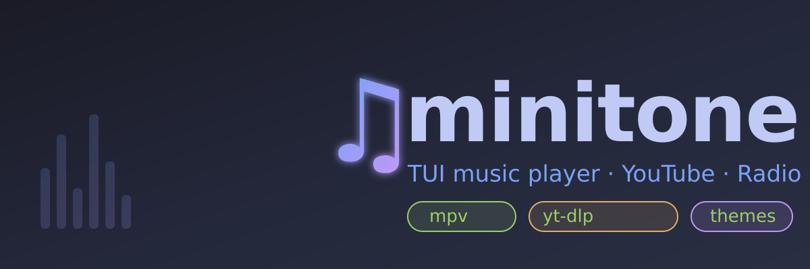
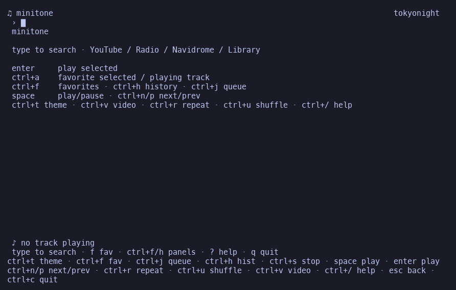
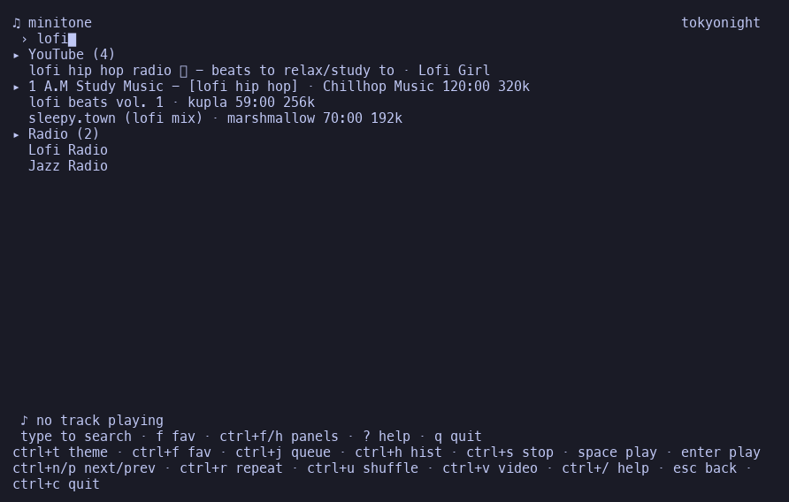
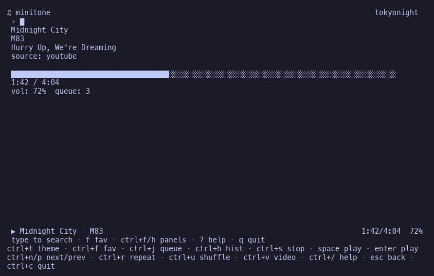
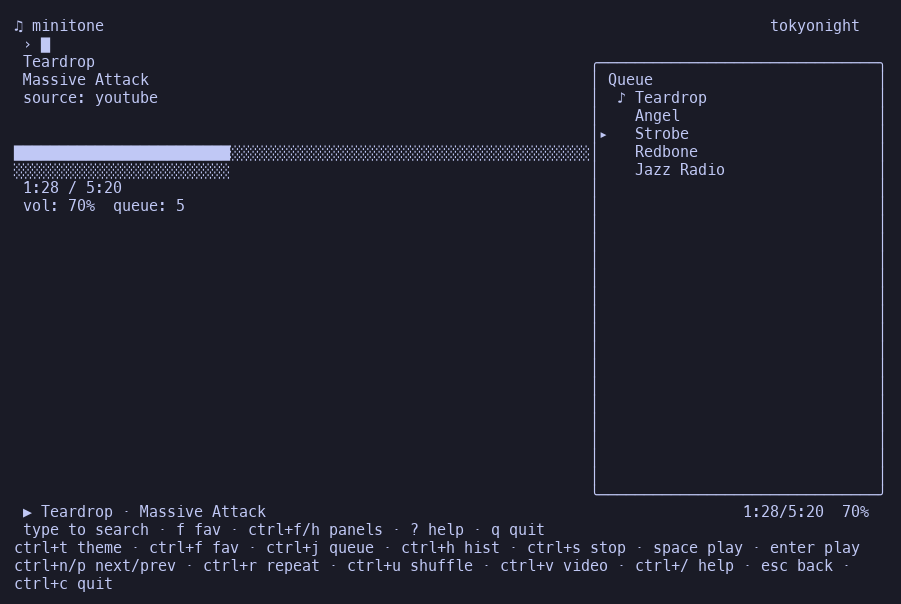
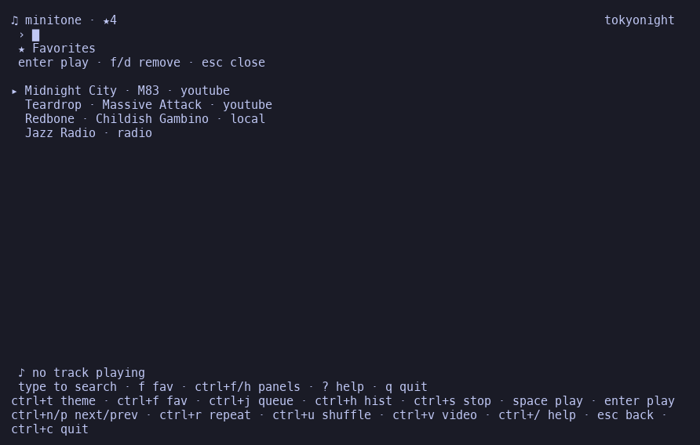
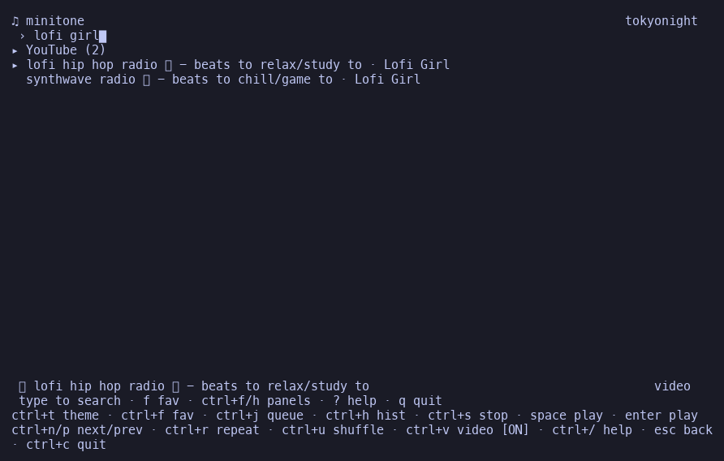

# minitone ♪

<p align="center">
  
</p>

<p align="center">
  <a href="https://github.com/ldgnu/minitone/releases/tag/v0.2.4"></a>
  
  <a href="https://aur.archlinux.org/packages/minitone"></a>
  
  
</p>

TUI music player — search and play from **YouTube**, **Radio Browser**, **Navidrome** (Subsonic), your **local library**, and **favorites**.

by [ldgnu](https://github.com/ldgnu)

<p align="center">
  
</p>

## Requirements

- **[mpv](https://mpv.io)** — playback backend
- **[yt-dlp](https://github.com/yt-dlp/yt-dlp)** — YouTube search & stream resolve (optional but recommended)
- Optional: a Navidrome (or Subsonic) server
- **Go 1.22+** if building from source

## Install

### One-liner (Linux / macOS)

```bash
curl -fsSL https://raw.githubusercontent.com/ldgnu/minitone/master/scripts/install.sh | sh
```

Downloads the latest prebuilt binary for your OS/arch into `/usr/local/bin` (or `~/.local/bin`). Pin a version with `MINITONE_VERSION=0.2.4 curl … | sh`.

### Arch Linux (AUR)

```bash
# from source
yay -S minitone
# or prebuilt binary (when published)
yay -S minitone-bin
```

PKGBUILDs live in [`packaging/aur/`](packaging/aur/).

### Debian / Ubuntu

```bash
# build a .deb from this repo
make deb
sudo dpkg -i dist/minitone_*.deb
```

See [`packaging/README.md`](packaging/README.md).

### go install

```bash
go install github.com/ldgnu/minitone/cmd/minitone@latest
```

### Prebuilt binary (any Linux)

Grab the archive for your arch from the [releases](https://github.com/ldgnu/minitone/releases) page:

```bash
curl -L -o minitone.tgz https://github.com/ldgnu/minitone/releases/download/v0.2.3/minitone-0.2.3-linux-amd64.tar.gz
tar xzf minitone.tgz
sudo mv minitone /usr/local/bin/ && sudo chmod +x /usr/local/bin/minitone
minitone
```

(arm64: `minitone-0.2.3-linux-arm64.tar.gz`)

### Manual

```bash
git clone https://github.com/ldgnu/minitone
cd minitone
make build
sudo make install
# or just:
./minitone
```

## Config

Optional file: `~/.config/minitone/config.json`

```json
{
  "navidrome_url": "http://localhost:4533",
  "navidrome_user": "user",
  "navidrome_pass": "pass",
  "theme": "fallout",
  "volume": 70,
  "library_paths": ["/home/you/Music"]
}
```

| Variable | Description |
|----------|-------------|
| `NAVIDROME_URL` | Subsonic/Navidrome base URL |
| `NAVIDROME_USER` | Username |
| `NAVIDROME_PASS` | Password |
| `MINITONE_THEME` / `AMUSIC_THEME` | Theme name |
| `MINITONE_LIBRARY` | Extra library paths (`:`-separated) |

Data files (auto-created):

| File | Purpose |
|------|---------|
| `~/.config/minitone/favorites.json` | Favorites |
| `~/.config/minitone/history.json` | Play history (last 200) |

## Usage

```bash
minitone
minitone --version
```

Type to search. Results are grouped by source. **enter** plays and queues.

### Keys

| Key | Action |
|-----|--------|
| type | Search |
| `enter` | Play selected (+ queue) |
| `esc` | Back: clear search / close panel |
| `tab` / `shift+tab` | Next / prev source group |
| `↑↓` | Navigate results |
| `space` | Play / pause (search empty) |
| `ctrl+n` / `ctrl+p` | Next / prev in queue |
| `ctrl+s` | Stop |
| `+` / `-` | Volume |
| `←` / `→` | Seek ±5s |
| `ctrl+m` | Mute toggle |
| `f` | Toggle favorite (playing track) |
| `ctrl+a` | Favorite selected search result |
| `ctrl+f` | Favorites panel |
| `ctrl+h` | History panel |
| `ctrl+j` | Queue panel (`d` delete, `f` fav) |
| `ctrl+u` | Shuffle toggle |
| `ctrl+r` | Repeat off → all → one |
| `ctrl+t` | Cycle theme |
| `ctrl+v` | Toggle video mode (YouTube plays with video) |
| `?` / `ctrl+/` | Help |
| `q` / `ctrl+c` | Quit |

> The search box is focused by default: just type (incl. `j`/`k`) to search. `esc` returns back — closing any open panel, or clearing the search box. Action shortcuts use `ctrl` to keep the search box always typing. While typing use `ctrl+c` to quit, `enter` to play.

### Panel shortcuts

| Panel | Open | Inside |
|-------|------|--------|
| Favorites | `ctrl+f` | `enter` play · `f`/`d` remove · `a` queue all |
| History | `h` | `enter` play · `d` remove · `c` clear · `f` fav |
| Queue | `ctrl+j` | `enter` play · `d` delete · `f` fav |

### Themes

`terminal`, `fallout`, `tokyonight`, `everforest`, `catppuccin`, `gruvbox`, `nord`, `kanagawa`, `dracula`, `monochrome`, `amber`

## Screenshots

<p align="center">
  
  
</p>
<p align="center">
  
  
</p>
<p align="center">
  
  
</p>

## Develop

```bash
make test          # all tests
make test-short    # skip live network
make build
make package       # tarball + deb → dist/
make release       # test + vet + package
```

## Architecture

```
cmd/minitone          entrypoint
internal/
  app/                wires player, sources, search, store, UI
  config/             config.json + env
  player/             mpv IPC backend
  queue/              shuffle / repeat queue
  search/             multi-source search + fuzzy rank
  store/              favorites + history (JSON)
  source/
    youtube/          yt-dlp
    radio/            Radio Browser API
    navidrome/        Subsonic wrapper
    library/          local filesystem scan
  subsonic/           Subsonic REST client
  ui/                 Bubble Tea TUI
  events/             event bus
  models/             Song types
  utils/              debounce, duration, keys
packaging/
  aur/                PKGBUILD (+ bin)
  README.md           packaging docs
scripts/build-deb.sh  Debian package builder
```

## Legal / Disclaimer

`minitone` is **not** affiliated with, endorsed by, or sponsored by YouTube,
Google, or any music service. It is a personal, open-source tool for playing
audio you have the right to access.

YouTube (and other remote) playback is delegated to third-party, locally
installed tools — `yt-dlp` for search/resolve and `mpv` for playback. `minitone`
**does not host, copy, redistribute, or modify any copyrighted content**; it only
builds a URL and hands it to your local player.

You are responsible for complying with the terms of service of each source and
with the copyright laws that apply in your jurisdiction. Use at your own risk.

If you prefer not to use YouTube, it is an optional dependency: the app also
works fully with Radio Browser, a Navidrome/Subsonic server and your local
library. You can disable it by leaving `yt-dlp` uninstalled.

## License

MIT — see [LICENSE](LICENSE).
