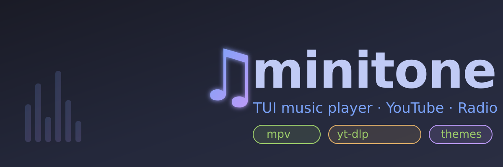
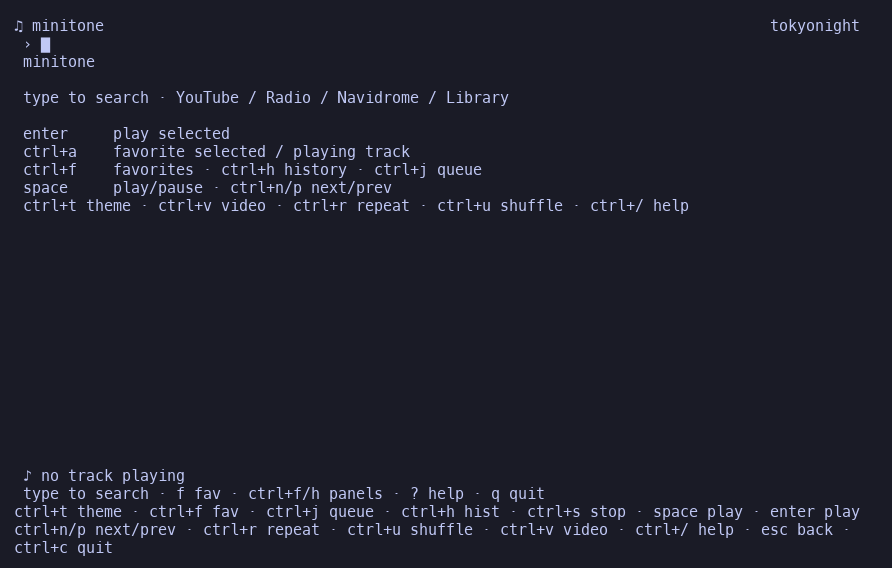
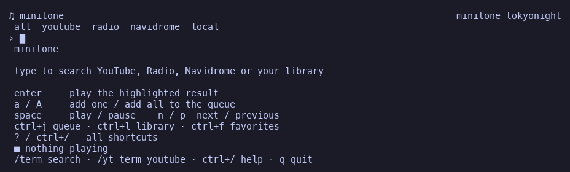
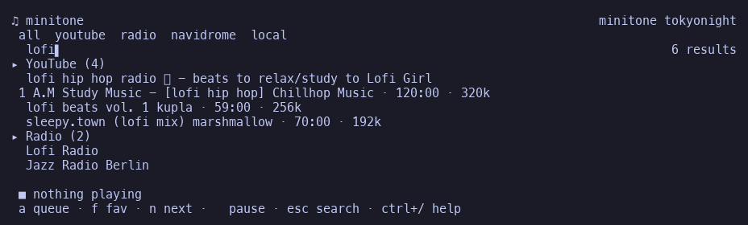
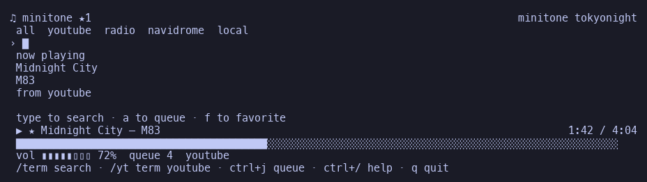
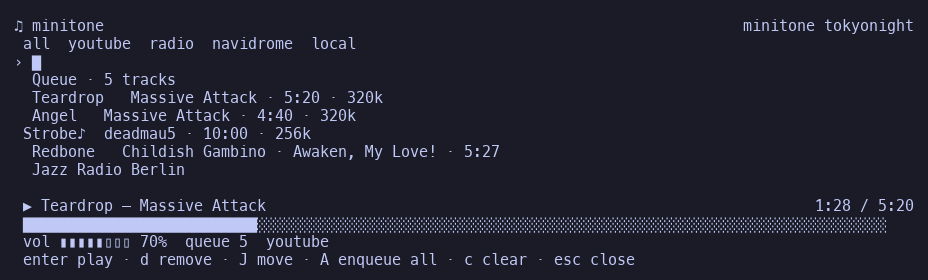
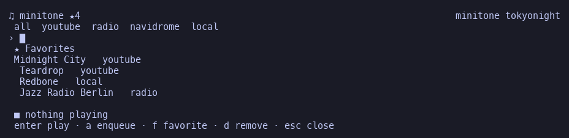
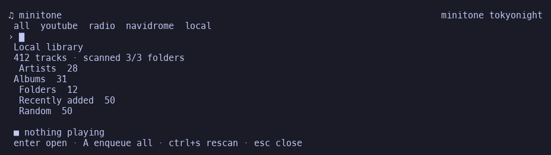
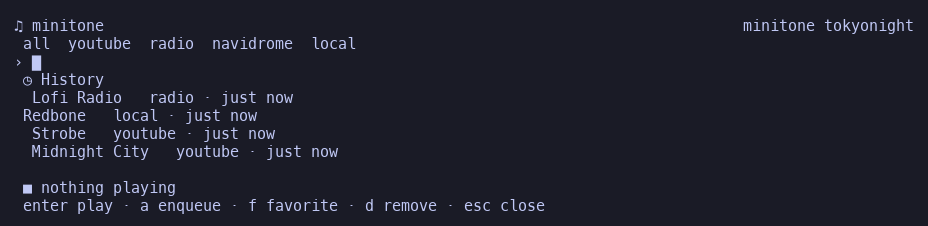
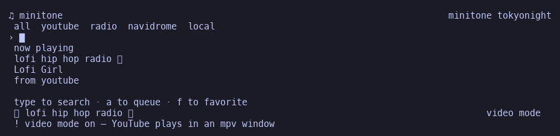

# minitone ♪

<p align="center">
  
</p>

<p align="center">
  <a href="https://github.com/ldgnu/minitone/releases/tag/v0.3.0"></a>
  
  <a href="https://aur.archlinux.org/packages/minitone"></a>
  
  
</p>

 TUI music player — search and play from **YouTube**, **Radio Browser**, **Navidrome** (Subsonic), your **local library**, and **favorites**.

 Selected YouTube results show a live **thumbnail preview** (rendered as ANSI/braille art, so it works in any terminal — no graphics protocol needed).

Keyboard-first and terminal-native: a persistent player bar, results that stream
in per source, cancelable searches, a browseable library, and a compact layout
for narrow windows.

by [ldgnu](https://github.com/ldgnu)

<p align="center">
  
</p>

## Requirements

- **[mpv](https://mpv.io)** — playback backend (required). For **video mode** (`ctrl+v`) you need a normal mpv **with video output** and a graphical session (X11/Wayland); on a headless server only audio plays. `ffmpeg` is recommended so mpv can handle more formats.
- **[yt-dlp](https://github.com/yt-dlp/yt-dlp)** — YouTube search & stream resolve (optional but recommended)
- Optional: a Navidrome (or Subsonic) server
- **Go 1.22+** if building from source

## Install

### One-liner (Linux / macOS)

```bash
curl -fsSL https://raw.githubusercontent.com/ldgnu/minitone/master/scripts/install.sh | sh
```

Downloads the latest prebuilt binary for your OS/arch into `/usr/local/bin` (or `~/.local/bin`). Pin a version with `MINITONE_VERSION=0.2.4 curl … | sh`.

### Arch Linux (AUR)

```bash
# from source
yay -S minitone
# or prebuilt binary (when published)
yay -S minitone-bin
```

PKGBUILDs live in [`packaging/aur/`](packaging/aur/).

### Debian / Ubuntu

```bash
# build a .deb from this repo
make deb
sudo dpkg -i dist/minitone_*.deb
```

See [`packaging/README.md`](packaging/README.md).

### go install

```bash
go install github.com/ldgnu/minitone/cmd/minitone@latest
```

### Prebuilt binary (any Linux)

Grab the archive for your arch from the [releases](https://github.com/ldgnu/minitone/releases) page:

```bash
curl -L -o minitone.tgz https://github.com/ldgnu/minitone/releases/download/v0.2.3/minitone-0.2.3-linux-amd64.tar.gz
tar xzf minitone.tgz
sudo mv minitone /usr/local/bin/ && sudo chmod +x /usr/local/bin/minitone
minitone
```

(arm64: `minitone-0.2.3-linux-arm64.tar.gz`)

### Manual

```bash
git clone https://github.com/ldgnu/minitone
cd minitone
make build
sudo make install
# or just:
./minitone
```

## Config

Optional file: `~/.config/minitone/config.json` — every field has a default, so
an empty or missing file works.

```json
{
  "navidrome_url": "http://localhost:4533",
  "navidrome_user": "user",
  "navidrome_pass": "pass",
  "theme": "fallout",
  "volume": 70,
  "library_paths": ["/home/you/Music"],
  "restore_session": true,
  "default_source": "all",
  "search_debounce_ms": 300,
  "keybindings": { "queue": "ctrl+q" }
}
```

| Field | Default | Description |
|-------|---------|-------------|
| `navidrome_url` / `_user` / `_pass` | — | Navidrome (Subsonic) server |
| `theme` | `terminal` | Any theme name from the list above |
| `volume` | `70` | 0–100 |
| `library_paths` | `~/Music` if present | Local library roots |
| `restore_session` | `true` | Remember queue, position, volume, shuffle, repeat |
| `default_source` | `all` | Source to search on startup |
| `search_debounce_ms` | `300` | Keystroke debounce (100–800) |
| `keybindings` | — | Override any action, e.g. `{"queue": "ctrl+q"}` |

`keybindings` accepts: `enter`, `esc`, `tab`, `play_pause`, `seek_back`,
`seek_forward`, `volume_up`, `volume_down`, `queue`, `favorites`, `history`,
`library`, `help`, `theme`, `video`, `repeat`, `shuffle`, `enqueue`,
`enqueue_all`, `favorite`, `details`, `delete`, `clear_queue`, `move_up`,
`move_down`, `next`, `prev`, `mute`, `stop`, `rescan`.

| Variable | Description |
|----------|-------------|
| `NAVIDROME_URL` / `_USER` / `_PASS` | Navidrome credentials (override the file) |
| `MINITONE_THEME` | Theme name |
| `MINITONE_VOLUME` | Volume |
| `MINITONE_RESTORE_SESSION` | `true` / `false` |
| `MINITONE_LIBRARY` | Extra library paths (`:`-separated) |

Data files (auto-created):

| File | Purpose |
|------|---------|
| `~/.config/minitone/favorites.json` | Favorites |
| `~/.config/minitone/history.json` | Play history (last 200) |
| `~/.config/minitone/session.json` | Queue, position and prefs for `restore_session` |

## Troubleshooting

minitone tells you when something is missing instead of failing silently.

| Message | What to do |
|---------|-----------|
| `mpv not installed` | Install mpv; nothing can play without it |
| `yt-dlp not installed` | YouTube is disabled; Radio/Navidrome/library still work |
| `Radio unavailable` | Check your connection, then `[r] retry` |
| `library is empty` | Set `library_paths`, then `ctrl+s` to scan |
| `mpv could not open …` | The stream or file is gone; `[n]` skips to the next track |
| `Navidrome is not configured` | Set the `navidrome_*` fields |

The status line always names the problem and the next key to press; the player
bar shows the real mpv state (including `loading` and `paused`), never just the
last command you sent.

## Usage

```bash
minitone
minitone --version
minitone --help
```

Type to search. Results stream in **per source**, so a slow source never blocks
the others. Press `tab` to move from the search box into the results and use
the single-key shortcuts.

### Two focus modes

This is the one thing worth understanding before the key list.

| Mode | What keys do |
|------|--------------|
| **Search** (default) | Every printable key is typed. Arrows / `tab` / `enter` jump to the results. |
| **Browse** | `j k` navigate, `f a d i c J K n p s m` act. Any *other* printable key returns to typing. |

That is how a search term can contain `s`, `d` or `n` (as in "depeche mode")
while those same keys remain shortcuts: press `esc` to go back to the search
box, or just start typing a different letter.

### Search prefixes

Restrict a query to one source without touching the selector:

```text
/search term          all sources
/youtube term         YouTube only
/radio term           Radio Browser only
/navidrome term       Navidrome only
/local term           local library only
/fav term             favorites only
```

### Keys

**Search**

| Key | Action |
|-----|--------|
| type | Search (all sources) |
| `/youtube term` etc. | Search one source |
| `backspace` | Delete a character |
| `esc` | Clear the query |
| `tab` / `shift+tab` | Move into results / cycle source group |
| `↑` `↓` | Move into results and navigate |

**Browse**

| Key | Action |
|-----|--------|
| `enter` | Play the highlighted result (+ queue) |
| `j` / `k` / `↑` / `↓` | Navigate |
| `a` | Add to queue |
| `A` | Add all results to queue (skips duplicates) |
| `f` | Add/remove favorite |
| `i` | Track details |
| `d` | Remove the playing track from the queue |
| `c` | Clear the queue |
| `J` / `K` | Move the playing track up / down |
| `n` / `p` | Next / previous track |
| `s` | Stop |
| `m` | Mute |

**Playback** (work anywhere)

| Key | Action |
|-----|--------|
| `space` | Play / pause (in Browse; types a space while searching) |
| `←` / `→` | Seek ∓5s |
| `+` / `-` | Volume |
| `ctrl+u` | Shuffle |
| `ctrl+r` | Repeat off → all → one |
| `ctrl+t` | Cycle theme |
| `ctrl+v` | Video mode (YouTube in an mpv window) |

**Panels**

| Key | Panel |
|-----|-------|
| `ctrl+j` | Queue |
| `ctrl+f` | Favorites |
| `ctrl+h` | History |
| `ctrl+l` | Local library |
| `ctrl+/` | Help |
| `ctrl+s` | Rescan the library |

Inside a panel: `↑↓`/`j k` navigate · `enter` play · `a` enqueue · `A` enqueue
all · `f` favorite · `d` remove · `J K` move (queue) · `c` clear (queue) ·
`esc` close.

`esc` always means *back*, one step at a time: dismiss an error → leave Browse →
close a panel → step out of a library section → clear the query.

`q` quits from Browse and from an empty search box; `ctrl+c` always quits.

### Themes

`terminal`, `fallout`, `tokyonight`, `everforest`, `catppuccin`, `gruvbox`,
`nord`, `kanagawa`, `dracula`, `monochrome`, `amber`

## Screenshots

<p align="center">
  
  
</p>
<p align="center">
  
  
</p>
<p align="center">
  
  
</p>
<p align="center">
  
  
</p>

## Develop

```bash
make test          # all tests
make test-race     # tests with the race detector
make test-short    # skip live network
make vet
make build
make package       # tarball + deb → dist/
make release       # test + vet + package
```

Render any UI state without touching mpv — useful for checking a layout:

```bash
go run ./cmd/minitone --screenshot <scenario> [w] [h] [theme]
# scenarios: welcome search playing queue favorites history
#            library details help video searching error compact narrow
```

## Architecture

```
cmd/minitone          entrypoint
internal/
  app/                wires player, sources, search, store, UI
  config/             config.json + env
  player/             mpv IPC backend (states, load confirmation, cleanup)
  queue/              shuffle / repeat / reorder / snapshot
  search/             streaming multi-source search + fuzzy rank
  store/              favorites + history + session (JSON)
  source/
    youtube/          yt-dlp
    radio/            Radio Browser API
    navidrome/        Subsonic wrapper
    library/          local filesystem scan + browse index
  subsonic/           Subsonic REST client
  ui/                 Bubble Tea TUI
    model.go          state (search, focus, panels, library)
    handle.go         the single key dispatcher
    update.go         message handling, search merge, playback
    view.go           layout: header, sources, search, body, player
    panels.go         queue / favorites / history / library / help overlays
    keys.go           keymap + contextual hints + help table
    notice.go         actionable status messages
  events/             event bus
  models/             Song types
  utils/              debounce, duration
packaging/
  aur/                PKGBUILD (+ bin)
  README.md           packaging docs
scripts/build-deb.sh  Debian package builder
```

Design notes:

- **One key dispatcher.** Context decides meaning; there is no second,
  unreachable switch.
- **State streams per source.** `search.Manager` emits an event per source as
  it finishes, guarded by a generation check so a stale query can never
  overwrite a newer one. UI never calls mpv, yt-dlp or HTTP itself.
- **The player bar shows real state.** `player.Player` only reports
  `playing`/`paused` once mpv says so; a load that never starts is confirmed
  over IPC and surfaced as an error.

## Legal / Disclaimer

`minitone` is **not** affiliated with, endorsed by, or sponsored by YouTube,
Google, or any music service. It is a personal, open-source tool for playing
audio you have the right to access.

YouTube (and other remote) playback is delegated to third-party, locally
installed tools — `yt-dlp` for search/resolve and `mpv` for playback. `minitone`
**does not host, copy, redistribute, or modify any copyrighted content**; it only
builds a URL and hands it to your local player.

You are responsible for complying with the terms of service of each source and
with the copyright laws that apply in your jurisdiction. Use at your own risk.

If you prefer not to use YouTube, it is an optional dependency: the app also
works fully with Radio Browser, a Navidrome/Subsonic server and your local
library. You can disable it by leaving `yt-dlp` uninstalled.

## License

MIT — see [LICENSE](LICENSE).
